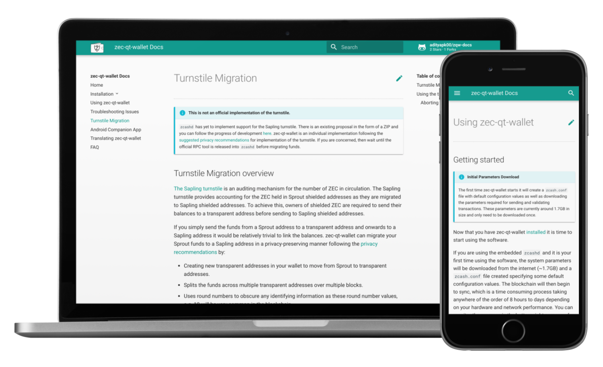

# zec-qt-wallet Documentation

Documentation and support resources for [zec-qt-wallet](https://github.com/ZcashFoundation/zec-qt-wallet), a z-Addr first, Sapling compatible wallet and full node for `zcashd` that runs on Linux, Windows and macOS.

See the [guide to contributing](/CONTRIBUTING.md) for how to build, test and deploy the documentation.  

