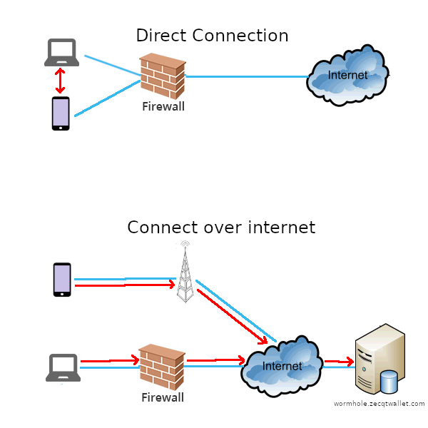
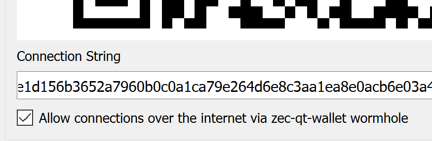

# Android Companion App

---

!!! warning "The Android app is beta software."
    Although everything will work fine on mainnet, since this is beta software, it is recommended you run it on the Zcash testnet. Add `testnet=1` into your [`zcash.conf`](/using-zec-qt-wallet/#customising-zcashconf) to [enable the testnet](/faq/#does-zec-qt-wallet-work-on-testnet).

**ZecQT Android** is an Android frontend for zec-qt-wallet that lets you send and receive payments from your mobile phone.

<iframe width="560" height="315" src="https://www.youtube-nocookie.com/embed/SIhG8fPsE8c" frameborder="0" allow="accelerometer; autoplay; encrypted-media; gyroscope; picture-in-picture" allowfullscreen></iframe>

## Participating in the beta

ZecQT Android is currently in beta, and to participate in the beta program you need to run zec-qt-wallet and install the APK on your Android phone. Head to the [releases page](https://github.com/adityapk00/zqwandroid/releases) to download the APK.

To let your Android phone connect to your desktop, you need to run a special version of zec-qt-wallet. You can download it from the [releases page](https://github.com/adityapk00/zqwandroid/releases) and run the binary for your platform. Note that the regular version of zec-qt-wallet doesn't let you connect your Android phone.

You can run your standard version of `zcashd` or let zec-qt-wallet run its embedded zcashd. Although everything will work fine on mainnet, since this is beta software, it is recommended you run it on the Zcash testnet. Add `testnet=1` into your [`zcash.conf`](/using-zec-qt-wallet/#customising-zcashconf) to [enable the testnet](/faq/#does-zec-qt-wallet-work-on-testnet).

After your node is synced, go to **Apps->Connect Mobile App** to view the connection QR Code that you can scan on the app.

## Install the Android APK

You'll need to allow **Install from untrusted sources** on your Android phone to install this APK. This is so that you can install the beta APK directly on your phone. (When this is publicly released, you'll be able to get it from the Google Play Store).

## What is a "direct connection" vs "connect over the internet/via wormhole.zecqtwallet.com"

When your phone and your desktop are on the same network (eg. on your home network), your phone can directly reach your desktop over your local network (if there are no firewalls blocking the connection). In this scenario, your phone directly communicates with your desktop zec-qt-wallet. This is the default.

If your phone is on a different network (if you're connected via 4G/LTE, for example) or if your desktop zec-qt-wallet is behind a firewall, your phone can't directly reach your desktop. In this scenario, your phone and desktop both connect to a service run by zec-qt-wallet (called wormhole.zecqtwallet.com), which routes information between your phone and your desktop.

## Android App FAQ

### How can I ensure that only direct connections are enabled?

This is already the default. If you want to connect over the internet via wormhole.zecqtwallet.com, you will need to opt-in by checking the **Connect over internet** checkbox on the connection page.

You can also disable connecting over the internet via wormhole.zecqtwallet.com in the Android app's settings.

### What data can the wormhole service see?

All communication is encrypted end-to-end, so the wormhole service can't see the content of your messages. It can see some meta-data like the IP addresses and date/timestamps.

### Will it always connect via the wormhole service?

The Android app will first attempt a direct connection each time you open the App. If a direct connection is not possible, it will then attempt to connect via wormhole (if enabled)

### How can I safely connect over the internet without using the wormhole service?

You'll need to install a VPN on your home network, so you can VPN into your network from 4G/LTE networks, and then connect directly to your node. For example, you can use a service such as [Pi VPN](https://www.pivpn.io/).

## Currently known limitations

After you download and install the APK, launch the program and scan the QR Code from your desktop to connect the two.
Currently known limitations

* Old-style Sprout addresses are not supported
* You can't select which address to send from. zec-qt-wallet will try to send Transactions from a Sapling address, given you have enough balance
* You can't generate new z-addrs or t-addrs from the phone.

## Issues or feature requests
Please file all the feedback you can. You can file issues in the [issues tab](https://github.com/adityapk00/zqwandroid/issues).