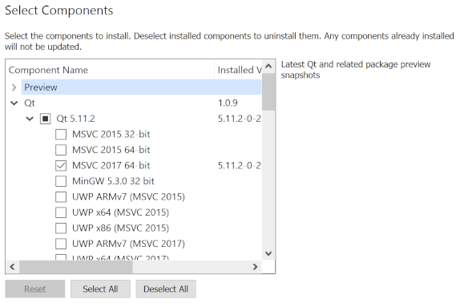

# Compiling from source

---

## Prerequisites
To build zec-qt-wallet locally, you need to install Qt v5.11 or higher. You can get the latest opensource version from the [Qt download site](http://www.qt.io). Download and install the Qt version for your platform. During the installation, you should also select the build version for your platform/compiler. 



zec-qt-wallet is written in C++ 14, so you'll also need a modern C++ compiler like g++/clang++/visual c++ depending on your platform. 

## Building on Linux

First, install the pre-requisites

``` bash
sudo apt install libgl1-mesa-dev
```

``` bash
git clone https://github.com/ZcashFoundation/zec-qt-wallet.git
cd zec-qt-wallet
/path/to/qt5/bin/qmake zec-qt-wallet.pro CONFIG+=debug
make -j$(nproc)

./zec-qt-wallet
```

## Building on Windows

You need Visual Studio 2017 (The free C++ Community Edition works just fine). Alternately, you can cross-compile on Linux for Windows using the mingw compiler. See [cross-compile instructions here](/setting-up-build-env/).

From the VS Tools command prompt:

``` bash
git clone https://github.com/ZcashFoundation/zec-qt-wallet.git
cd zec-qt-wallet
c:\Qt5\bin\qmake.exe zec-qt-wallet.pro -spec win32-msvc CONFIG+=debug
nmake

debug\zec-qt-wallet.exe
```

To create the Visual Studio project files so you can compile and run from Visual Studio:

``` bash
c:\Qt5\bin\qmake.exe zec-qt-wallet.pro -tp vc CONFIG+=debug
```

## Building on Mac
You need to install the [Xcode](https://developer.apple.com/xcode/) app or the [Xcode](https://developer.apple.com/xcode/) command line tools first, and then install Qt. 

``` bash
git clone https://github.com/ZcashFoundation/zec-qt-wallet.git
cd zec-qt-wallet
/path/to/qt5/bin/qmake zec-qt-wallet.pro CONFIG+=debug
make 

./zec-qt-wallet.app/Contents/MacOS/zec-qt-wallet
```