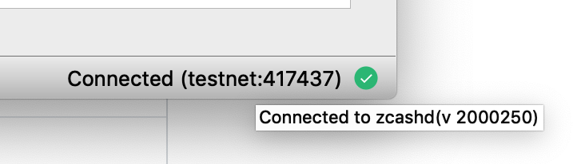
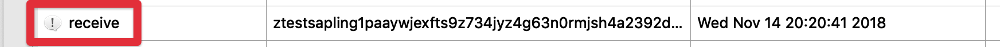

# FAQ
---

## Installation

### Where do I download the software?

ZecWallet is available to download from the [Zcash Foundation GitHub repository](https://github.com/ZcashFoundation/zecwallet). The [releases page](https://github.com/ZcashFoundation/zecwallet/releases) lists the latest available downloads for each platform.

The Android application, which is still in beta, may be downloaded [from here](https://github.com/adityapk00/zqwandroid/releases).

### Which version should I download?

See the [installation](/installation/#download-and-install) section for more details specific for your platform.

### How do I verify the download file?

Starting from v0.5.10 all [ZecWallet releases](https://github.com/ZcashFoundation/zecwallet/releases) are signed. You may download the detached signatures on the [releases page](https://github.com/ZcashFoundation/zecwallet/releases) and verify that the software was signed with the published [public key](https://raw.githubusercontent.com/ZcashFoundation/zecwallet/master/public_key.asc). In addition, each release contains SHA256 checksums that may additionally be verified. For more information, see the [Verifying the download](/installation/#verifying-the-download) section of the [Installation guide](/installation/).

## Blockchain

### Is ZecWallet a light client?

No, ZecWallet requires a full `zcashd` node to operate. A [light client protocol](https://z.cash/blog/zcash-reference-wallet-light-client-protocol/) is currently in development that would substantially reduce the storage and bandwidth requirements for a light wallet. Currently, to use shielded transactions, you need to run a full node.

### How large is the blockchain?

Currently, the blockchain data directory is around 22GB (Feb 2019) and will continue to grow over time.

### Can I change the location of the data directory?

If you are starting ZecWallet for the first time, then you can choose the **Advanced Config** option and select the desired location of your data directory, which may, for example, be on a separate disk. 


If you have an existing data directory you would like to move, you can achieve this through the following steps, with ZecWallet closed:

* Create the new directory.
* Move everything in your [existing data directory](/faq/#where-is-the-default-data-directory-on-each-platform) to the new location with the exception of `zcash.conf` which must remain in the original data directory location.
* Update [`zcash.conf`](/using-zecwallet/#customising-zcashconf) to add the line `datadir=/your/new/path` specifying the path to the newly created folder.
* Restart ZecWallet.

### Can I move the params directory?

No, unlike the data directory there is no configurable option to specify the params directory and `zcashd` expects the params directory to be in the following locations:

* Windows: `%HOMEPATH%\AppData\Roaming\ZcashParams`
* macOS: `~/Library/Application Support/ZcashParams`
* Linux: `~/.zcash-params`

The folder should contain the following files and all are (currently) required for `zcashd` to function.

```
3.5M sapling-output.params
46M  sapling-spend.params
692M sprout-groth16.params
869M sprout-proving.key
1.5K sprout-verifying.key
```

As a workaround, you can use any filesystem operations for your OS, e.g. creating a symlink of the directory, but these are unsupported.

## Transactions

### Can I use funds with zero confirmations?

No, Zcash requires that you have at least 1 confirmation before sending. Trying to spend unconfirmed funds will [result in an error](/troubleshooting/#not-enough-balance-when-sending-transactions).

### Can I use a custom fee?

Yes, though it is advised to use the default 0.0001 fee to prevent your transactions from being distinguishable, you may override this behaviour in the app [**Options**](/using-zecwallet/#zeqwallet-options).

### What's the difference between Transparent, Sprout and Sapling addresses?

Transparent addresses start with a **t** prefix and are transparent like Bitcoin and offer no privacy properties. Sprout addresses have a **zc** prefix and are the first generation of shielded addresses. Sprout addresses have been superseded by Sapling addresses which have a **zs** prefix. While Sprout addresses may still be used, it is recommended to use Sapling addresses due to the [performance improvements](/faq/#how-long-does-a-sapling-transaction-take) and updated system parameters. To move funds between Sprout and Sapling addresses see the [turnstile migration documentation](/turnstile-migration/). For more detailed information on the types of addresses in Zcash [see this page](https://zcash.readthedocs.io/en/latest/rtd_pages/addresses.html).

Note that on testnet, transparent addresses have a prefix **tm**, Sprout have a **zt** prefix and Sapling **ztestsapling**.

### How long does a Sapling transaction take?

Sapling greatly reduced the time taken to perform shielded proofs down to just a few seconds though this value does depend on hardware and the number of shielded inputs/outputs. Sending from a transparent address to a Sapling one is typically completed in under 0.5 seconds. Legacy Sprout transactions take in the order of 70-90 seconds but this is also dependent on hardware and the number of JoinSplits. For more information see [this post](https://z.cash/blog/reducing-shielded-proving-time-in-sapling/).

## zcashd node

### Where is the default data directory on each platform?

By default, the location of the data directory, which stores the wallet, `zcash.conf` and all blockchain data, is found in the following locations. It is possible to [move this data directory](/faq/#can-i-change-the-location-of-the-data-directory).

* Windows: `%HOMEPATH%\AppData\Roaming\Zcash`
* macOS: `~/Library/Application Support/Zcash`
* Linux: `~/.zcash`

### Where is `zcash.conf` located?

`zcash.conf` is located in the [default data directory](/faq/#where-is-the-default-data-directory-on-each-platform) and will be in this location even if the `datadir` parameter has been set to a custom value.

### Can I use ZecWallet with an external node?

Yes, see [this section](/using-zecwallet/#connecting-to-an-external-zcashd) for how to connect to an external `zcashd`.

### How do I find the version of zcashd that I am running?

To find the version of `zcashd` you are running simply hover over the blockchain data in the lower right-hand corner and a popup will appear with the `zcashd` version string:



### Does ZecWallet work on testnet?

Yes, ZecWallet will work on testnet. To do so add the following lines to your [zcash.conf](using-zecwallet/#customising-zcashconf) file, replacing the existing values if present:

``` bash
addnode=testnet.z.cash
testnet=1
```

### Does ZecWallet support payment disclosure?

Not yet. While [payment disclosure](https://z.cash/blog/viewing-keys-selective-disclosure/) works on Sprout addresses, `zcashd` has not yet been updated to support Sapling. There is [a plan to support this](https://github.com/ZcashFoundation/zecwallet/issues/47) once implemented by `zcashd`.

### Does ZecWallet support viewing keys?

Not yet, as `zcashd` doesn’t currently support Sapling viewing keys and will be implemented in ZecWallet once supported.

### How do I use the zcash-cli command?

You may interact with the [Zcash Payment API](https://zcash.readthedocs.io/en/latest/rtd_pages/payment_api.html) via RPC calls using the Zcash command line interface. You may wish to do this to enable advanced functionality or to debug issues outside of the ZecWallet interface. See [this page](https://zcash.readthedocs.io/en/latest/rtd_pages/payment_api.html) for an overview of the Zcash RPC commands available. To use, follow the instructions for [using the `zcash-cli stop` command](/troubleshooting/#via-an-external-zcashd) simply replacing `stop` with the command you wish to run. For example, to query the detail of a completed shielded transaction on a Mac you would run:

`/Applications/zecwallet.app/Contents/MacOS/zcash-cli z_getoperationresult`

## Wallet

### Is the wallet encrypted?

No, wallet encryption is [currently disabled](https://github.com/zcash/zcash/blob/master/doc/security-warnings.md#wallet-encryption) by `zcashd`. You should use full-disk encryption (or encryption of your home directory) to protect your `wallet.dat` file at rest, and should assume (even unprivileged) users who are running on your OS can read your `wallet.dat` file.

### Why does my change go to a new address?

Like Bitcoin, when using transparent addresses, change from a transaction goes to a new transparent address. ZecWallet allows you to set an option to automatically send this change to a Sapling address via the application [**Options**](/using-zecwallet/#zecwallet-options). As the 'feature' was added in Bitcoin as a measure to preserve privacy and prevent trivial linking of transactions on the blockchain, shielded (z) addresses do not have this property and any change is returned to the sending (z) address by default.

### Will ZecWallet remember my outgoing shielded sends?

Yes, by default ZecWallet will store shielded sends locally as `zcashd` does not provide this information. You can override this behaviour via the [**Options**](/using-zecwallet/#zeqwallet-options) setting and you can remove any stored transactions at any time by choosing the **Clear History** button (note that these will not be later recoverable if you delete them).

### How do I read a memo?

If there is a [memo](/using-zecwallet/#encrypted-memo-field) attached to a transaction then it will be visible by a message icon in the transaction listing. Simply right-click the transaction and choose **View Memo** to read its encrypted contents.



### Can I use ZecWallet with a hardware wallet?

No, this is currently not supported.

### Can I remove an address from the wallet?

No, addresses cannot be removed from the wallet. It is advised that you [export the private keys](/using-zecwallet/#export-a-single-private-key) for addresses you are interested in and then delete the `wallet.dat` file. You can then [import the private keys](/using-zecwallet/#importing-private-keys) you require in a fresh, empty wallet.

### Seed phrases

#### Can I import private keys from a recovery phrase / BIP39 Mnemonic?

No, ZecWallet cannot import private keys from a recovery phrase directly. To do so you will need to extract your private keys from the recovery phrase. You can use a tool such as [https://iancoleman.io/bip39/](https://iancoleman.io/bip39/) entering the BIP39 Mnemonic (your recovery phrase) and choosing Zcash as the coin.

Once you have entered these values look for the section entitled **Derived Addresses** which will list all the derived addresses and private keys for those addresses. You will need to [import the private keys](using-zecwallet/#importing-private-keys) for any transparent addresses where you have funds, remembering that [change in transparent addresses goes to a new address](/faq/#why-does-my-change-go-to-a-new-address).

!!! danger "Be very careful with your recovery seed"
    Access to your recovery seed allows anyone to steal all of your Zcash. Though the tool listed above runs locally in your browser and is fully open source, you can always [save the HTML](https://iancoleman.io/bip39/) file and run on an airgapped offline device for extra security.

#### Can I export a BIP39 seed phrase?

No, this is not supported.

#### Can I export the Sapling HD seed?

Sapling does [implement an HD wallet](https://z.cash/blog/sapling-in-hd/) however at present the only way to extract this is to perform the `z_exportwallet` command via `zcashd` and is unsupported in ZecWallet due to needing to write to an export directory. To extract the Sapling HD seed you need to run `zcash-cli z_exportwallet` after specifying an `exportdir` in `zcash.conf`. See [these instructions](/troubleshooting/#via-an-external-zcashd) for more details on working with the Zcash RPC CLI. 

#### Can I import the Sapling HD seed?

Not at present, however, this feature will be added when supported by `zcashd`.

### Can I mine with ZecWallet?

No, ZecWallet is a wallet and full node. While you can configure `zcashd` to run the built-in CPU miner, this isn't practical to run on mainnet and you need alternative hardware and software to run. See [this page](https://www.zcashcommunity.com/mining/) for more information on mining.

## WinZEC

### How do I upgrade from WinZEC / zcash4mac / zcash4win?

[WinZEC](http://winzec.com/) and its predecessor zcash4win (and zcash4mac) have now been deprecated. You can simply install ZecWallet and it'll use the existing data directory and wallet from any previous installation and operate as normal.

### Can I import the WinZEC address book?

Yes, in the [Address Book](/using-zecwallet/#address-book) click to **Import Address Book** and browse to the location of the WinZEC address book file. By default this will be `%HOMEPATH%\AppData\Local\ZcashSwingWalletUI\addressBook.csv` where `%/HOMEPATH%` is typically `C:\Users\username\` and you may need to enable viewing hidden files to browse to the `AppData` folder location.


## In what languages is ZecWallet available?

Currently, it is available in French, Spanish, Portuguese and Italian. If you want to help by translating see the [Translating ZecWallet](/translations/) page.

## Why are there references to both zec-qt-wallet as well as ZecWallet?

The original wallet was named **zec-qt-wallet** and was renamed in March 2019 to **ZecWallet** so any references to the wallet before that date will use the zec-qt-wallet name. The previous name of zec-qt-wallet may remain in places where updating would cause issues with signing releases and upgrades.
