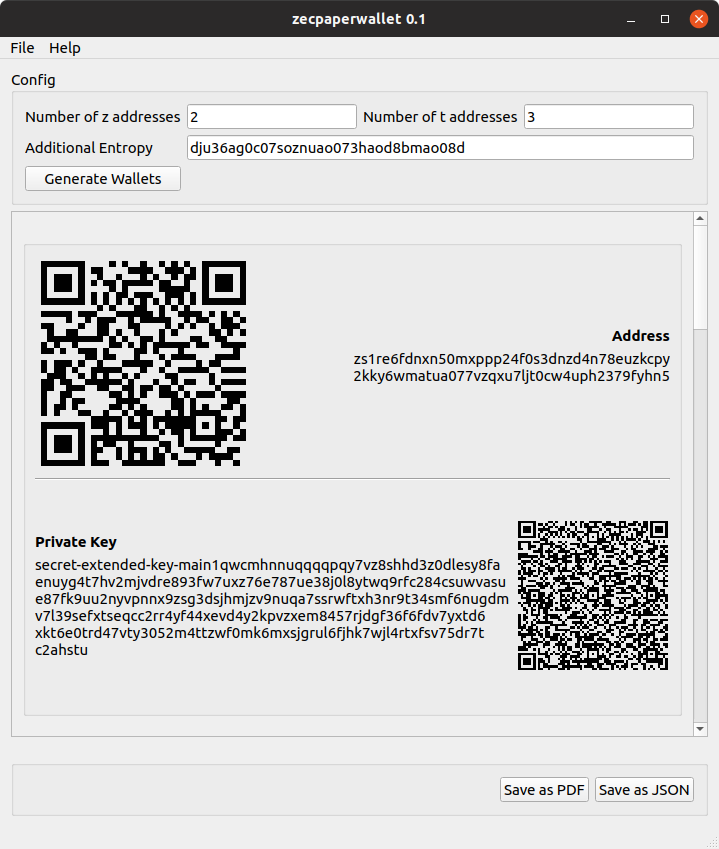

# zecpaperwallet
zecpaperwallet is a Zcash Sapling paper wallet generator that can run completely offline. You can run it on an air-gapped computer to generate your shielded z-addresses, which will allow you to keep your keys completely offline. 



# Download
zecpaperwallet is available as pre-built binaries from our [release page](https://github.com/adityapk00/zecpaperwallet/releases). Download the zip file for your platform, extract it and run the `./zecpaperwallet` binary. 

# Generating wallets
To generate a Zcash paper wallet, simply run the binary, enter the number of z-addresses and t-addresses you'd like to generate, and click "generate"

You can also enter some random characters that will add entropy to the random number generator. It's recommended you type some random characters here before clicking "generate".

## Saving as PDFs
To generate a Zcash paper wallet, click the `Save to PDF` button or select `File -> Save to PDF`. All your current wallets will be saved to the PDF. You can also save the wallets into a text file.


# Compiling from Source
zecpaperwallet is built with Qt and rust. To compile from source, you [install Rust](https://www.rust-lang.org/tools/install), and [install Qt5](https://doc.qt.io/qt-5/gettingstarted.html). 

Checkout the zecpaperwallet repository and build the UI
```
git clone https://github.com/adityapk00/zecpaperwallet.git
cd zecpaperwallet/ui
qmake paperwallet.pro
make -j4
```

### Run without network
If you are running a newish version of Linux, you can be doubly sure that the process is not contacting the network by running zecpaperwallet without the network namespace.

```
sudo unshare -n ./zecpaperwalletui
```
`unshare -n` runs the process without a network interface which means you can be sure that your data is not being sent across the network. 
