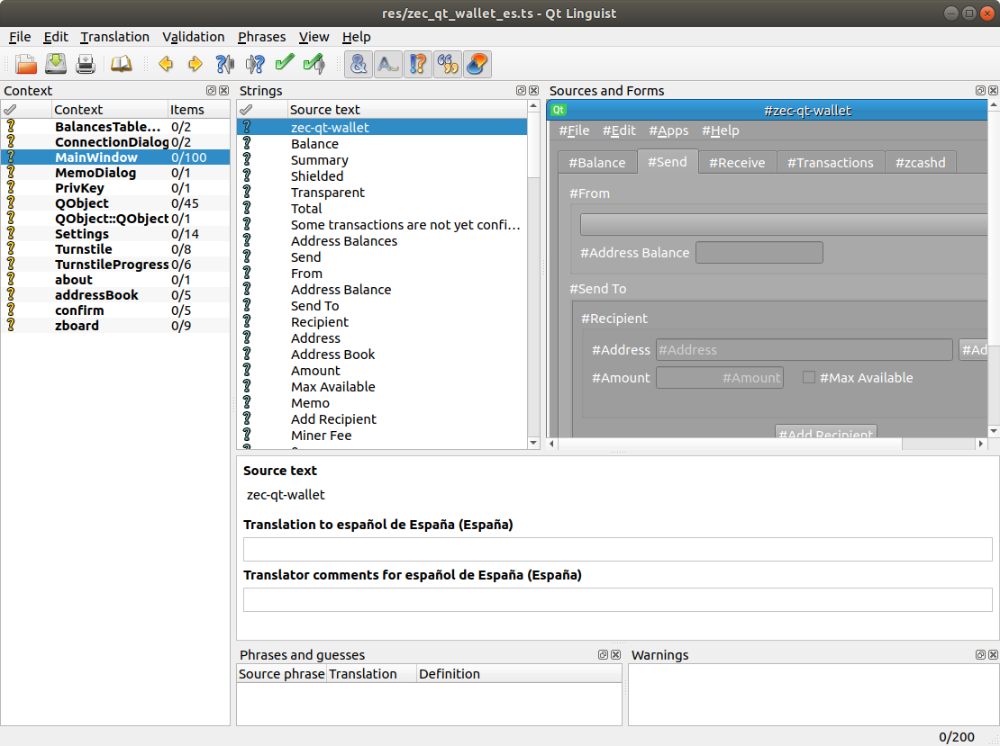

# Translating zec-qt-wallet

---

To help with translations, first clone/fork the [`zec-qt-wallet` repository](https://github.com/ZcashFoundation/zec-qt-wallet). In the `res/` folder, you will find a number of `*.ts` files which contain the translations. If you don't find your language listed, please copy the `zec-qt-wallet_template.ts` file and use that.

You can open the `*.ts` file (which is an XML file) and enter the translated strings manually using your favourite text editor, and enter the translations in the `translation` XML tag. It might be more productive to use the [Qt Linguist tool](/translations/#installing-and-using-qt-linguist), which provides a nice UI that has additional context and easily manages the strings for translations.

## Installing and using Qt Linguist

You can install the Qt open source distribution [from here](http://www.qt.io), and that comes with Qt Linguist. You can launch it by launching `/path/to/Qt5/bin/linguist res/zec_qt_wallet_<language code>.ts`. 

Windows and Mac builds for standalone Qt Linguist are [available here](https://github.com/lelegard/qtlinguist-installers/releases).



## Submitting translations

Once you have updated the translations in the `*.ts` file, please create a [pull request](https://github.com/ZcashFoundation/zec-qt-wallet/compare) for the file. Please remember to "confirm" the translations from the Linguist menu (or remove the "unfinished" tag from XML element, if you are editing manually).

!!! tip "Incomplete translations"
    You don't have to translate all the strings. You can do this incrementally, and zec-qt-wallet will use all available translated strings, else fall back to English.

## Testing translations

If you want to test the translations locally, you'll have to compile zec-qt-wallet. Please see [compiling from source](/compile-from-source/) instructions.

Save the linguist file, and then, from a command prompt (remember to replace `ln` with your language code):

``` bash
# Compile the translations
/path/to/qt5/bin/lrelease res/zec_qt_wallet_<ln>.ts
# Add to the Qt5's base translations
/path/to/qt5/bin/lconvert -o res/zec_<ln>.qm res/zec_qt_wallet_<ln>.qm /path/to/qt5/translations/qtbase_<ln>.qm
# Copy to the res folder
mv res/zec_<ln>.qm res/zec_qt_wallet_<ln>.qm
```

After this, you can launch your compiled zec-qt-wallet with a LANG environment variable to force zec-qt-wallet to use that language.

``` bash
LANG=es ./zec-qt-wallet
```
