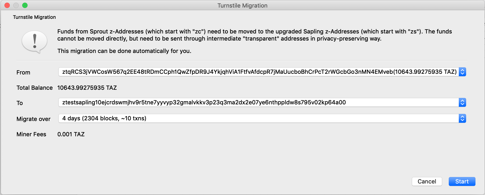
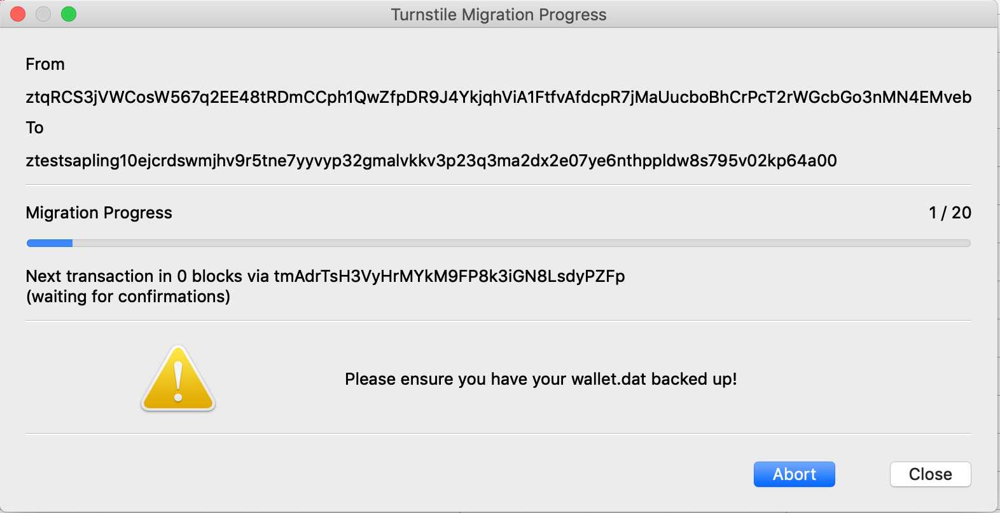

# Turnstile Migration

---

!!! info "This is not an official implementation of the turnstile."
    `zcashd` has yet to implement support for the Sapling turnstile. There is an existing proposal in the form of a ZIP and you can follow the progress of development [here](https://github.com/zcash/zips/pull/197). zec-qt-wallet is an individual implementation following the [suggested privacy recommendations](https://zcash.readthedocs.io/en/latest/rtd_pages/sapling_turnstile.html#privacy-recommendations) for implementation of the turnstile. If you are concerned, then wait until the official RPC tool is released into `zcashd` before migrating funds.

## Turnstile Migration overview

[The Sapling turnstile](https://zcash.readthedocs.io/en/latest/rtd_pages/sapling_turnstile.html) is an auditing mechanism for the number of ZEC in circulation. The Sapling turnstile provides accounting for the ZEC held in Sprout shielded addresses as they are migrated to Sapling shielded addresses. To achieve this, owners of shielded ZEC are required to send their balances to a transparent address before sending to Sapling shielded addresses.

If you simply send the funds from a Sprout address to a transparent address and onwards to a Sapling address it would be relatively trivial to link the balances. zec-qt-wallet can migrate your Sprout funds to a Sapling address in a privacy-preserving manner following the [privacy recommendations](https://zcash.readthedocs.io/en/latest/rtd_pages/sapling_turnstile.html#privacy-recommendations) by:

* Creating new transparent addresses in your wallet to move from Sprout to transparent addresses.
* Splits the funds across multiple transparent addresses over multiple blocks.
* Uses round numbers to obscure any identifying information as these round number values, e.g. 10 will be very common in the blockchain.

## Using the turnstile tool

To start the turnstile migration tool, open it by choosing **Apps->Sapling Turnstile** and choose the Sprout address (zc) to migrate funds from and the Sapling address (zs) to send funds too in addition to the number of days you would like to migrate the funds over.

Generally, increasing the option to migrate over a larger number of blocks is the preferred solution but note that there will be an increase in the number of transactions, all of which require a fee. The migrate over 4 days (2304 blocks) requires 10 transactions resulting in fees of 0.001 ZEC for the migration.

Note that you may only perform one migration at a time using the app.

!!! tip "Closing the wallet during the migration."
    If you shut down the wallet, then it'll send any pending transactions on reopening, which may result in the undesired behaviour of multiple transactions occuring back-to-back. The wallet **must** be open for any transactions to be sent so you should open it frequently and preferably leave it open throughout.

To check on the progress of the turnstile at any time visit **Apps->Sapling Turnstile** and you will be presented with the migration progress and the number of blocks until the next transaction.

!!! danger "Backup your wallet.dat file after starting the migration."
    zec-qt-wallet creates **new** transparent addresses for the turnstile migration. You must create a backup after confirming the migration to ensure you have the private keys for these intermediate transparent addresses in case there is an issue. To do so visit **File->Backup wallet.dat**.

### Aborting the turnstile migration

If at any time you wish to abort the migration visit **Apps->Sapling Turnstile** and choose **Abort**, and no further transactions will take place. After aborting, all the funds remain in the addresses when the migration was aborted.