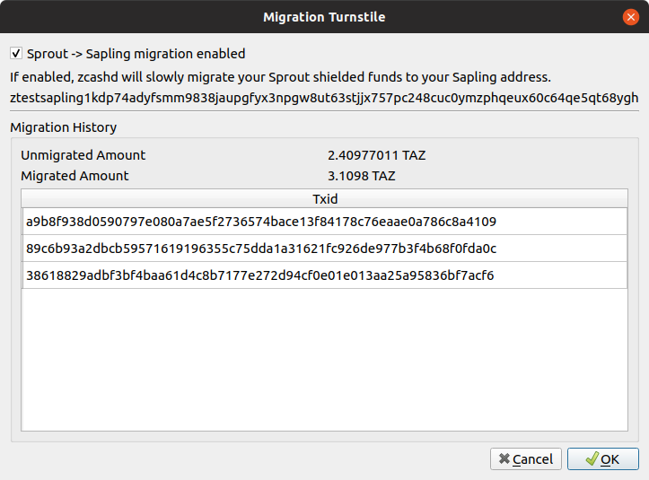

# Turnstile Migration

---

[The Sapling turnstile](https://zcash.readthedocs.io/en/latest/rtd_pages/sapling_turnstile.html) is an auditing mechanism for the number of ZEC in circulation. The Sapling turnstile provides accounting for the ZEC held in Sprout shielded addresses as they are migrated to Sapling shielded addresses. To achieve this, owners of shielded ZEC are required to send their balances through the transparent value pool, thus revealing the balance, before sending to Sapling shielded addresses.

!!! tip "Upgrade to version 0.7.2 or higher to use the native migration tool in zcashd"
    Starting from [v0.7.2](https://github.com/ZcashFoundation/zecwallet/releases/tag/0.7.2) there is support for the native Sprout to Sapling migration tool in zcashd. Documentation for the previous custom migration tool available in ZecWallet is [archived here](/turnstile-migration-archived).

### Using the turnstile tool

To enable the turnstile migration tool navigate to **Apps->Sapling Turnstile** and simply check the box to enable the Sprout to Sapling migration. Whenever the blockchain reaches a 500 block height interval, up to 5 migration transactions are created with transaction amounts picked according to a random distribution moving the funds from any Sprout addresses to a Sapling one. The full specification of this tool can be found in [ZIP 308](https://github.com/zcash/zips/blob/master/zip-0308.rst). 

Please see the [zcashd blog post](https://electriccoin.co/blog/sprout-to-sapling-migration-tool/) for further details.

!!! tip "Customising the destination Sapling address."
    By default, the destination address will be the default Sapling address of the wallet. You may specify a different Sapling address to migrate to by specifying the `migrationdestaddress` parameter in your [`zcash.conf` file](/using-zecwallet/#customising-zcashconf).

To check on the progress of the turnstile at any time, visit **Apps->Sapling Turnstile** and you will be presented with the full migration history detailing all transactions that have occurred as well as the amount left to migrate.

!!! info "Closing the wallet during the migration."
    If you are not using an external zcashd and shut down the wallet, then no funds will be migrated. The wallet will start to prepare transactions 5 blocks before the 500 block height interval (to allow for the time to create Sprout transactions) so the wallet should be open during this period. If the wallet is not open and a 500 block height interval passes, no action will take place until the next 500 block height interval.

### Aborting the turnstile migration

If at any time you wish to abort the migration, visit **Apps->Sapling Turnstile** and simply uncheck the **Sprout->Sapling migration** checkbox and no further transactions will be sent. If you enabled the migration externally from ZecWallet you may need to remove the line `migration=1` from your `zcash.conf` file.
