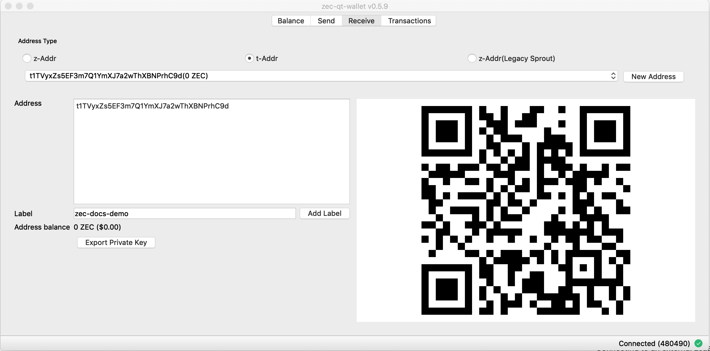
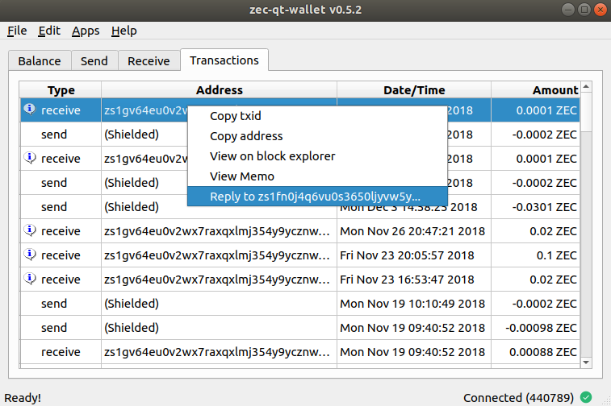

# Using zec-qt-wallet
---

## Getting started

!!! info "Initial Parameters Download"
    The first time zec-qt-wallet starts it will create a `zcash.conf` file with default configuration values as well as downloading the parameters required for sending and validating shielded transactions. These parameters are currently around 1.7GB in size and only need to be downloaded once.

Now that you have zec-qt-wallet [installed](/installation) it is time to start using the software. 

If you are using the embedded `zcashd` and it is your first time using the software, the system parameters will be downloaded from the internet (~1.7GB) and a [`zcash.conf`](/using-zec-qt-wallet/#customising-zcashconf) file created specifying some default configuration values. The blockchain will then begin to sync, which is a time-consuming process taking anywhere of the order of 8 hours to days depending on your hardware and network performance. You can monitor the progress in the bottom right corner of zec-qt-wallet which displays the number of blocks downloaded and a sync percentage.


!!! info "Initial Sync"
    The blockchain is around **22GB** in size and will take around 8+ hours to download. Monitor the progress via the sync progress in the bottom right corner of zec-qt-wallet.

## Generating a new address

Visiting the **Receive** tab of zec-qt-wallet will show all current addresses in the wallet and enable you to generate new ones. To learn about the different types of addresses available in Zcash which are transparent, shielded (Sprout and Sapling) please visit [this page](https://zcash.readthedocs.io/en/latest/rtd_pages/addresses.html). It is not possible to remove an address from the wallet once it has been generated.

!!! tip "Backup after generating a new address"
    Whenever a new address is generated you should ensure that you have a backup of the address. Only Sapling uses a HD wallet and can be [recreated from a seed](https://z.cash/blog/sapling-in-hd/) whereas transparent or Sprout addresses either require the private key or a `wallet.dat` backup made after the address was created. See the [Backing up section](/using-zec-qt-wallet/#backing-up) for more details.



Transparent addresses are automatically created when clicking the **t-Addr** button as transparent addresses should not be reused. Unlike transparent addresses, it is fine to [reuse shielded addresses](https://z.cash/blog/shielded-address-contexts/) and so new addresses can be manually created on-demand via the **New Address** button.

Optionally, add a label to easily identify the address and add it to your address book. A QR code is also provided for the address which may be used to scan into a compatible application to receive funds.

zec-qt-wallet will also show if the address has been previously used.

## Sending a transaction

Once you've generated an address and have sent some funds to it, you can send some ZEC. Click on the **Send** tab:


You can only send funds with at least one confirmation. While transactions are being confirmed, they are easily identifiable as they are highlighted in red.

Choose an address with funds in it and enter the recipient address. You may specify multiple recipients per transaction, and there may be a mixture of transparent and shielded recipients. [The Memo field](/using-zec-qt-wallet/#encrypted-memo-field) is only available when sending **to** a shielded address (either Sprout or Sapling). The default mining fee is 0.0001 ZEC which is recommended for all transactions. See the [Options section](/using-zec-qt-wallet/#zeq-qt-wallet-options) if you wish to customise this behaviour and understand the implications.

!!! info "Shielded send requirements"
    Sending Sapling transaction require little resource usage and happen in a few seconds. If you still have funds in legacy Sprout addresses sending times are typically around 70-90 seconds and require an additional 1.3GB of memory to perform the spend. 

### Viewing transaction on explorer

Once complete, the txid will be displayed. Right-click to bring up a menu to view on a block explorer. Alternatively, for any transactions on the **Transactions** tab right click and choose **View on block explorer**.

This will open up the transaction [on a block explorer](https://explorer.testnet.z.cash/tx/9f790a9522dc049ef57d6ef75e2dc1fe65969c933dcaaeb7c230b2df288fbeb0). If your transaction is a shielded one there will not be any public information available except the fee paid.

### Pay Zcash URI

You can enter a Zcash URI by visiting **File->Pay Zcash URI** and pasting in the payment link. Zcash payment URIs encode the address, amount and memo into a single convenient string, so you can enter it into zec-qt-wallet and make payments easily.


## Address book

The address book makes managing addresses and labels simple. Either select **Address Book** in the application menu or select the button on the **Send** tab. 

You can import an address book in csv format and users of WinZEC can [import an existing address book](/faq/#can-i-import-the-winzec-address-book).


## Backing up

zec-qt-wallet provides multiple options to ensure your wallet and keys are backed up. It is important that you perform regular backups if you are not exclusively using Sapling addresses and have the Sapling seed. While Sapling has a [HD wallet](https://z.cash/blog/sapling-in-hd/), support for importing the seed is not yet available.

!!! warning "It is not yet possible to import a Sapling HD seed"
    While Sapling provides a [HD wallet](https://z.cash/blog/sapling-in-hd/) the feature for importing the seed does not yet exist, so while your funds would not be lost in the situation where you have the seed they would be rendered unusable until this feature is added. Therefore it is recommended you keep regular backups of either private keys or the `wallet.dat` file until this feature is implemented. 

### Export a single private key

To export a single private key on the **Balance** tab right click on the address and choose **Get private key** from the context menu. Alternatively, on the **Receive** tab choose the address in question and click the **Export Private Key**. The output of both is the private key which you can copy to a secure storage medium or be used to import into other applications.


### Export all private keys

You can export all private keys for addresses in your wallet by choosing the **File->Export all private keys** menu option. This will provide a list of all private keys in the wallet.

Note that by default when `zcashd` starts it creates 100 transparent addresses for the keypool for use as change addresses hence this list will always contain at least 100 transparent address keys, not all of which have been used. 

### Backing up wallet.dat

You can backup all of your private keys by making a copy of the `wallet.dat` file. To restore, you then replace any existing `wallet.dat` file in the [data directory](/faq/#where-is-the-default-data-directory-on-each-platform) and start zec-qt-wallet as normal. 

!!! danger "Create a new backup after each new address generated"
    As new addresses are generated you will need to create an updated backup else the new private keys will not be included.

While this is a convenient method of backing up, it means that you are restricted to importing to software compatible with `zcashd` and also if you have many addresses that are unused it will slow rescanning of the wallet over say importing only your addresses with funds.

## Importing private keys

To import a private key, choose the **Import private key** from the File main menu. You may paste in multiple keys, one per line that will be imported into the wallet. Note that depending on the number of keys to import and if they are shielded addresses it may take some time for the import to be completed.


## zeq-qt-wallet options

zec-qt wallet has a number of options that allow you to customise how the application behaves and may be accessed in the **Settings->Options** menu as shown below.


### Remember shielded transactions

By default `zcashd` will not store information about your outgoing fully shielded transactions (z->z). By default, zec-qt-wallet will store outgoing transactions locally so that any shielded spends will appear in the transactions tab. If you do not wish these transactions to be saved by zec-qt-wallet simply toggle the option for **Remember shielded transactions**. At any point, you may clear your shielded transaction history locally by choosing the **Clear History** button (there is no way of recovering this data once cleared).

### Allow custom fees

Choose this option to allow the ability to change the default 0.0001 ZEC transaction fee. As all fees are transparent it is highly recommended that you use the default fee for all transactions to make your transactions indistinguishable. 

### Shield change to your Sapling address

Like Bitcoin, when using transparent addresses, change from a transaction goes to a new transparent address which can lead to your funds being spread over multiple addresses. zec-qt-wallet allows you to set an option to automatically send this change to a Sapling address via the **Shield change from t-Addresses to your sapling address** option. As for transparent addresses this was a measure to preserve privacy and prevent trivial linking of transactions on the blockchain shielded (z) addresses do not have this property and any change is returned to the sending address.

### Connect via TOR

When using Zcash [it does nothing to preserve your network level privacy](https://z.cash/support/security/privacy-security-recommendations) so a unique IP address can allow network observers to correlate your Zcash transactions with each other and with your other traffic. To overcome this, you may use TOR to obfuscate your IP address.

You will first need to have TOR installed which you may do from the [official site](https://www.torproject.org/download/download.html). You will need to download and run the TOR Expert Bundle (not TOR browser). TOR is also available on all popular package managers, e.g. macOS `brew install tor` or Debian `apt install tor`.

Once running choose the option in zec-qt-wallet to **Connect via TOR** and the following line will be added to your [`zcash.conf`](/using-zec-qt-wallet/#customising-zcashconf) file to configure TOR usage `proxy=127.0.0.1:9050`. Restart `zcashd`  to enable the service running over TOR.

Use the advanced options when installing zec-qt-wallet to run `zcashd` over TOR from the initial startup, so your IP is never exposed to the network.

!!! warning "Parameters are not currently downloaded over TOR"
    As per this [issue](https://github.com/ZcashFoundation/zec-qt-wallet/issues/97) the Zcash parameters that are downloaded on the first launch are not done so over TOR. 


#### Onion Nodes

You can connect to Zcash nodes only behind onion addresses by adding the following into your [`zcash.conf`](/using-zec-qt-wallet/#customising-zcashconf) file which will ensure that your IP address is not exposed to any Zcash-related services when running `zcashd`.

```
proxy=127.0.0.1:9050
onlynet=onion
```

Then provide a list of onion nodes to connect to. A sample list is provided below but these may change over time.

```
addnode=zcmaintvsivr7pcn.onion
addnode=zcashiqykswlzpsu.onion
addnode=zcashqhrmju6zfhn.onion
addnode=zcashgmvxwrmjsut.onion
addnode=zcashz3uma65ix7b.onion
addnode=zcashiyf4kxluf3x.onion
addnode=zcashwfe4x3jkz2b.onion
addnode=zcashvkeki52iqpc.onion
addnode=zcasha3cmfrpy7b7.onion
addnode=zcashz7ed3nvbdxm.onion
addnode=zcash5adwfpxfuvf.onion
addnode=zcashixg5ol2ndo4.onion
addnode=zcashuzwa365oh3n.onion
addnode=zcashskbeoiwtym3.onion
addnode=zcashuyvk5e7qfzy.onion
addnode=fhsxfrwpyrtoxeal.onion
addnode=zcash2iihed2wdux.onion
addnode=w3dxku36wbp3lowx.onion
addnode=zcashuhmzycmlwld.onion
```

## Encrypted Memo field

The encrypted memo field allows a user to include an optional memo of up to 512 bytes in their transaction. As the transaction is encrypted on the blockchain only the recipient of the transaction can read the memo. This could, for example, be used to include information about the sender for a purchase or a refund address and there is more detail about potential uses of this field in this [blog post](https://z.cash/blog/encrypted-memo-field/).

You can only include a memo when sending **to** a shielded address. To include a memo in a transaction click the **Memo** button and it will provide a textbox allowing you to enter 512 characters. 


### Including a reply-to address

If you want to send a reply-to address in the memo field, for example, if you are using the memo field as an encrypted chat application, zec-qt-wallet allows you to include a reply-to address in a standard format. To use, press the **Include Reply Address** and the sending address will automatically be inserted.


### Replying to a memo

If you receive a transaction with a memo that contains a [reply address](#/using-zec-qt-wallet/#including-a-reply-address), you can reply to it directly from the transactions table. Simply right-click the transaction and choose **Reply to xxx**.



## Exporting transactions

zec-qt-wallet allows you to export all transactions via the **File->Export Transactions** menu item. You will be prompted where to store the exported file and it will be saved as a csv file with the following headers: 

| Type   | Address  | Date/Time    | Amount    | Memo   |
| ---    | ---      | ---          | ---       | ---    |

## Apps

zec-qt-wallet bundles some applications to make common tasks simpler.

### Using z-board.net

[z-board.net](http://z-board.net/) is a message board based on the [encrypted memo field](/using-zec-qt-wallet/#encrypted-memo-field). When using shielded addresses messages are anonymous. zec-qt-wallet integrates with the z-board.net service by allowing you to choose topics and post to the correct address without manually adding it.


### Turnstile migration

See the [page on the turnstile migration](#turnstile-migration) for full details.

## Customising `zcash.conf`

The `zcash.conf` file may be used to customise how the `zcashd` software behaves. There are many [configuration options available](https://zcash.readthedocs.io/en/latest/rtd_pages/zcash_conf_guide.html). When zec-qt-wallet is installed it creates this file with sensible defaults such as connecting to the mainnet and a random rpcpassword. The location of `zcash.conf` varies by system. It is located in the following location on each platform:

* Windows: `%HOMEPATH%\AppData\Roaming\Zcash\zcash.conf`
* macOS: `~/Library/Application Support/Zcash/zcash.conf`
* Linux: `~/.zcash/zcash.conf`

## Connecting to an external `zcashd`

If you have an external `zcashd` running zec-qt-wallet will attempt to connect to it automatically. If this fails you can manually set the required settings via the **Edit->Settings** menu item and specifying the connection details in the **zcashd connection** tab.

Note that the easiest way to connect to a remote node is probably to ssh to it with port forwarding:

``` bash
ssh -L8232:127.0.0.1:8232 user@remotehost
```

You can disable the embedded `zcashd` and force zec-qt-wallet to only connect to an external node by starting zec-qt-wallet with the `-no-embedded` option.

!!! danger "Exposing RPC port"
    Using the RPC port over a remote interface is NOT RECOMMENDED, because that will cause the rpcpassword to be transmitted over the network unencrypted, allowing any observer to steal your keys and Zcash and take over the OS account running zcashd.